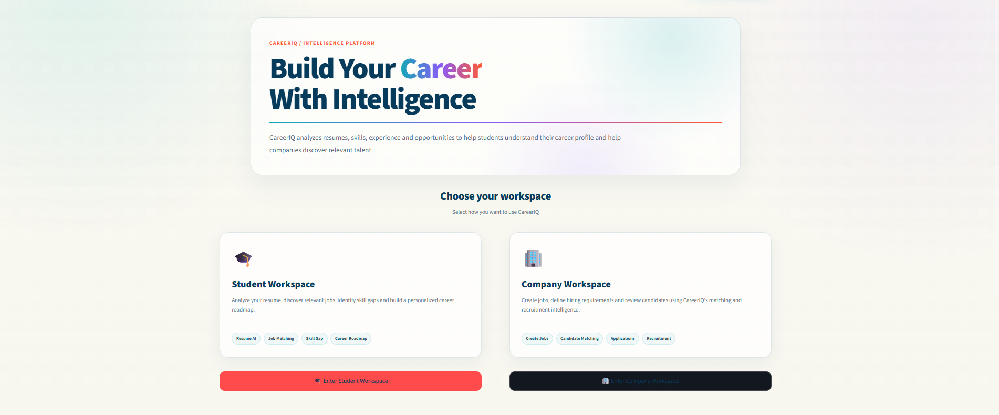
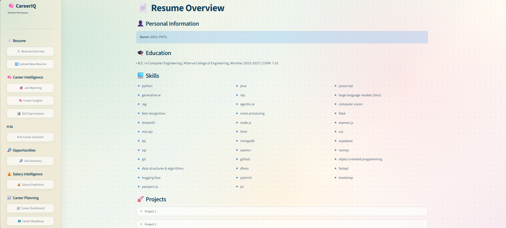
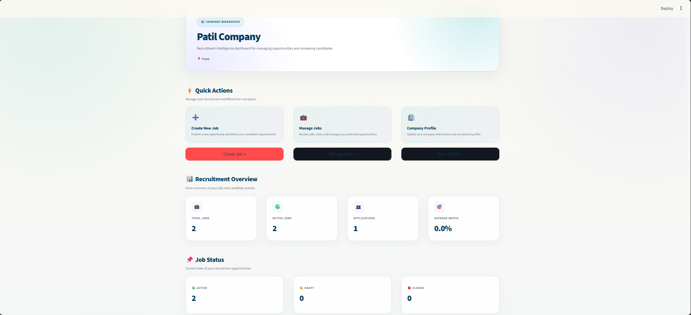
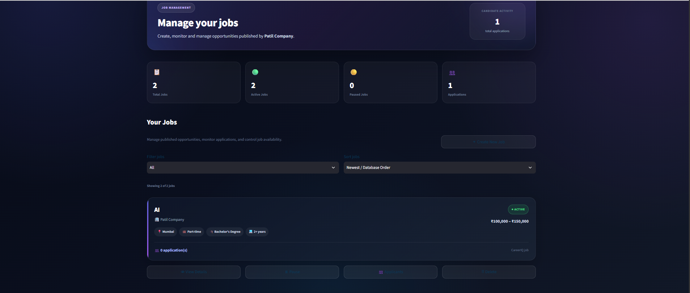
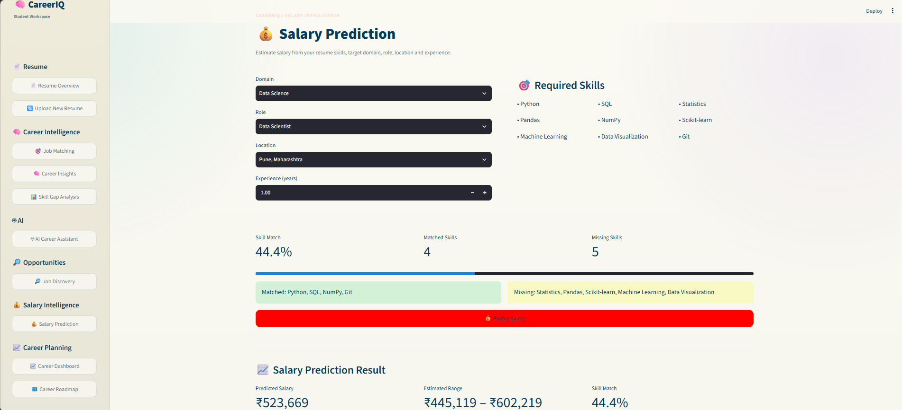

# CareerIQ

### AI-Powered Career Intelligence & Job Matching Platform

An AI-powered career intelligence and job-matching platform that analyzes resumes, predicts suitable career roles, matches candidates with job requirements, identifies skill gaps, and provides personalized career guidance.

🔗 Live Demo: [https://careeriq-anuj-patil.streamlit.app/](url)

📌 Overview

Job Intelligent System is an AI/ML-based web application designed to help students and job seekers understand their career potential and find suitable career opportunities.

The system analyzes a user's resume and extracts important information such as:

👤 Name
🎓 Education
💻 Skills
📂 Projects
💼 Experience
📜 Certifications

The extracted profile is then used across different modules for career analysis and job matching.

🚀 Features
📄 Resume Analysis

Upload your resume and automatically extract structured information including education, skills, projects, experience, and certifications.

🎯 Job Matching

Compare your profile with job requirements and calculate:

💻 Skill Match
🎓 Education Match
💼 Experience Match
🏆 Overall Job Match
🧠 Career Insights

Analyze your profile and identify suitable career roles based on your skills and background.

📊 Skill Gap Analysis

Select a target career role and identify:

✅ Matched Skills
❌ Missing Skills
➕ Additional Skills
📈 Skill Gap Score
📚 Learning Recommendations
🤖 AI Career Assistant

Ask career-related questions and receive AI-powered guidance related to:

Career paths
Technical skills
Projects
Interviews
Learning strategies
Job preparation
🔎 Job Discovery

Discover relevant job opportunities based on your career profile and interests.

📈 Career Dashboard

View important career information and analysis results through an interactive dashboard.

🗺️ Career Roadmap

Get structured guidance for developing skills and preparing for your selected career path.

                    ┌──────────────────────┐
                    │       User           │
                    └──────────┬───────────┘
                               │
                               ▼
                    ┌──────────────────────┐
                    │   Streamlit UI       │
                    └──────────┬───────────┘
                               │
                               ▼
                    ┌──────────────────────┐
                    │   Resume Upload      │
                    └──────────┬───────────┘
                               │
                               ▼
              ┌─────────────────────────────────┐
              │       Resume Processing         │
              │  PyMuPDF + Tesseract OCR        │
              └───────────────┬─────────────────┘
                              │
                              ▼
              ┌─────────────────────────────────┐
              │     AI Profile Extraction       │
              │        OpenAI / LLM              │
              └───────────────┬─────────────────┘
                              │
                              ▼
                   ┌──────────────────────┐
                   │ Candidate Profile    │
                   └──────────┬───────────┘
                              │
          ┌───────────────────┼────────────────────┐
          ▼                   ▼                    ▼
 ┌────────────────┐  ┌─────────────────┐  ┌─────────────────┐
 │ Career Role    │  │  Job Matching   │  │  Skill Gap      │
 │ Prediction     │  │                 │  │  Analysis       │
 └────────────────┘  └─────────────────┘  └─────────────────┘
          │                   │                    │
          └───────────────────┼────────────────────┘
                              ▼
                    ┌──────────────────────┐
                    │ Career Insights &    │
                    │ Recommendations      │
                    └──────────────────────┘

🛠️ Tech Stack
Programming Language
Python
Frontend / Web Application
Streamlit
AI / Machine Learning
OpenAI API
Scikit-learn
Natural Language Processing
Semantic Similarity
Machine Learning
Data Processing
Pandas
NumPy
Resume Processing
PyMuPDF
Tesseract OCR
Python-docx
Database
SQLite / project database
Development Tools
Git
GitHub
VS Code
Virtual Environment

📂 Project Structure

Job-Intelligent-System/
│
├── app.py
├── requirements.txt
├── .env
│
├── config/
│   ├── settings.py
│   └── prompts.py
│
├── src/
│   ├── ui/
│   │   ├── home.py
│   │   ├── resume.py
│   │   └── assistant.py
│   │
│   ├── resume/
│   │   ├── parser.py
│   │   ├── skill_extractor.py
│   │   ├── experience_analyzer.py
│   │   └── resume_scorer.py
│   │
│   ├── matching/
│   │   └── job_matcher/
│   │       ├── skill_matcher.py
│   │       ├── education_matcher.py
│   │       ├── experience_matcher.py
│   │       ├── experience_semantic_matcher.py
│   │       └── calculate_experience.py
│   │
│   ├── career/
│   │   ├── career_recommender.py
│   │   ├── role_predictor.py
│   │   ├── skill_gap_analyzer.py
│   │   └── career_roadmap.py
│   │
│   ├── rag/
│   ├── agents/
│   ├── llm/
│   ├── database/
│   └── job_discovery/
│
└── data/

⚙️ How It Works
Step 1 — Upload Resume
The user uploads a resume through the Streamlit interface.

Step 2 — Extract Resume Text
The system first uses PyMuPDF to extract text.
For scanned/image-based resumes, Tesseract OCR is used as a fallback.

Step 3 — Generate Candidate Profile
The extracted text is analyzed using an AI model to generate a structured profile containing:
Name
Education
Skills
Projects
Experience
Certifications

Step 4 — Career Analysis
The profile is analyzed to determine suitable career roles and career insights.

Step 5 — Job Matching
The candidate profile is compared with job requirements.

Skill Match
     +
Education Match
     +
Experience Match
     ↓
Overall Job Match
Step 6 — Skill Gap Analysis

The system compares the candidate's current skills with the required skills for the selected career role.

Current Skills
       ↓
Required Skills
       ↓
Skill Comparison
       ↓
Matched + Missing Skills
       ↓
Learning Recommendations
Step 7 — Career Guidance

The AI Career Assistant and Career Roadmap provide personalized guidance based on the user's profile.

📊 Machine Learning

The project can use machine-learning techniques for job matching and candidate analysis.

A job-matching model can use features such as:

Skill Match
Education Match
Experience Match
Semantic Similarity
        ↓
Machine Learning Model
        ↓
Matched Score

The matching score can then be converted into a percentage for user-friendly display.

🎯 Target Users
🎓 Students
👨‍💻 Fresh Graduates
💼 Job Seekers
🧑‍💼 Recruiters
🏢 Companies
🎓 Educational Institutions
🔮 Future Scope

Future versions of the Job Intelligent System can include:

Advanced career-role prediction
Transformer-based semantic job matching
RAG-based career assistant
AI career agents
Automated job discovery
Company recruitment portal
Candidate ranking
Salary prediction
Job-market trend analysis
Authentication and role-based access
Career progress tracking
Mobile application

## 📸 Screenshots

### 🏠 Home

### 📄 Resume Analysis

### 🏢 Company Dashboard

### 💼 Manage Jobs

### 💰 Salary Prediction

🌐 Live Demo

Try the deployed application:

https://careeriq-anuj-patil.streamlit.app/

⚠️ Note

The application may require access to AI services for some features. Results generated by AI should be treated as career guidance, not as a guaranteed assessment of employment suitability.

👨‍💻 Author

Anuj Patil

B.E. Computer Engineering
Atharva College of Engineering, Mumbai
